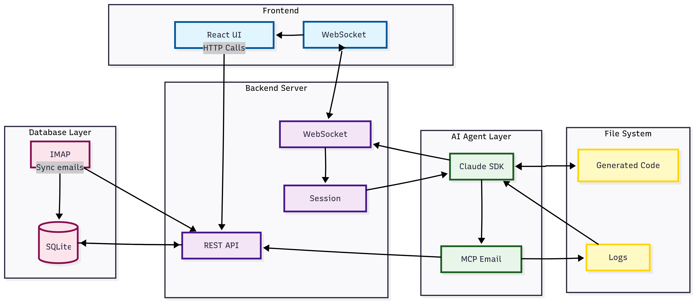

# Email Agent Demo

> ⚠️ **IMPORTANT**: This is a demo application by Anthropic. It is intended for local development only and should NOT be deployed to production or used at scale.

A demonstration email client powered by Claude and the Claude Code SDK, showcasing AI-powered email management capabilities.

## Architecture



## 🔒 Security Warning

**This application should ONLY be run locally on your personal machine.** It:
- Stores email credentials in plain text environment variables
- Has no authentication or multi-user support
- Is not designed for production security standards

## Prerequisites

- [Bun](https://bun.sh) runtime (or Node.js 18+)
- An Anthropic API key ([get one here](https://console.anthropic.com))
- Email account with IMAP access enabled

## Installation

1. Clone the repository:
```bash
git clone https://github.com/anthropics/sdk-demos.git
cd sdk-demos/email-agent
```

2. Install dependencies:
```bash
bun install
# or npm install
```

3. Create environment file:
```bash
cp .env.example .env
```

4. Configure your credentials in `.env` (see IMAP Setup below)

5. Run the application:
```bash
bun run dev
# or npm run dev
```

6. Open your browser to `http://localhost:3000`

## IMAP Setup Guide

### Gmail Setup

Gmail requires an **App Password** instead of your regular password:

1. **Enable 2-Factor Authentication** (required for app passwords):
   - Go to [Google Account Security](https://myaccount.google.com/security)
   - Click on "2-Step Verification" and follow the setup

2. **Generate an App Password**:
   - Go to [Google App Passwords](https://myaccount.google.com/apppasswords)
   - Select "Mail" from the dropdown
   - Select your device (or choose "Other" and name it "Email Agent")
   - Click "Generate"
   - **Copy the 16-character password** (you won't see it again!)

3. **Configure `.env`**:
```env
ANTHROPIC_API_KEY=your-anthropic-api-key
EMAIL_USER=your-email@gmail.com
EMAIL_PASSWORD=your-16-char-app-password  # NOT your regular password!
IMAP_HOST=imap.gmail.com
IMAP_PORT=993
```

## Support

This is a demo application provided as-is. For issues related to:
- **Claude Code SDK**: [SDK Documentation](https://docs.anthropic.com/claude-code)
- **Demo Issues**: [GitHub Issues](https://github.com/anthropics/sdk-demos/issues)
- **API Questions**: [Anthropic Support](https://support.anthropic.com)

## License

MIT License - This is sample code for demonstration purposes.

---

Built by Anthropic to demonstrate the [Claude Code SDK](https://github.com/anthropics/claude-code-sdk)