# Recursive Code Generation - Email Agent Listeners

## Twitter Thread Content

### Tweet 2: How Listeners Work

Listeners are TypeScript files that respond to email events. The magic? They can spawn Claude subagents on-demand using `context.callAgent()`.

This creates a recursive pattern: your code calls AI, which can generate structured outputs to inform your code's decisions.

```mermaid
sequenceDiagram
    participant Email as 📧 New Email
    participant LM as ListenersManager
    participant Listener as 💻 Your Listener Code
    participant Agent as 🤖 Claude Subagent
    participant Actions as ⚡ Email Actions

    Email->>LM: email_received event
    LM->>LM: Find matching listeners
    LM->>Listener: handler(email, context)

    Note over Listener: Your TypeScript code runs

    Listener->>Agent: context.callAgent({<br/>  prompt: "Is this a finance email?",<br/>  schema: { category, confidence }  <br/>})

    Note over Agent: AI analyzes email content

    Agent-->>Listener: { category: "finance", confidence: 0.95 }

    Note over Listener: Decision logic based on AI output

    Listener->>Actions: context.addLabel("Finance")
    Listener->>Actions: context.starEmail()

    Listener-->>LM: Return result
    LM->>LM: Log execution
```



## The Recursive Pattern

**Why "recursive"?**

1. **You write code** - Create a listener in TypeScript
2. **Code spawns AI** - Your listener calls `context.callAgent()`
3. **AI returns structured data** - Gets schema-validated response
4. **Code uses AI output** - Makes decisions based on AI analysis
5. **Repeat as needed** - Any listener can spawn multiple agents

This creates flexible automation where:
- Complex logic stays in your code (control flow, email operations)
- Nuanced decisions delegate to AI (categorization, sentiment, extraction)
- Everything is type-safe and logged

## Real Example: Finance Email Labeler

```typescript
// agent/custom_scripts/listeners/finance-email-labeler.ts
export async function handler(email: Email, context: ListenerContext) {
  // Option 1: Simple heuristics (current implementation)
  const hasFinanceKeywords = checkKeywords(email);
  if (hasFinanceKeywords) {
    await context.addLabel(email.messageId, "Finance");
  }

  // Option 2: AI-powered (when callAgent is implemented)
  const analysis = await context.callAgent({
    prompt: `Analyze this email and determine if it's finance-related:
             From: ${email.from}
             Subject: ${email.subject}
             Body: ${email.body}`,
    schema: {
      type: "object",
      properties: {
        isFinance: { type: "boolean" },
        category: { type: "string", enum: ["invoice", "payment", "statement"] },
        confidence: { type: "number" }
      }
    }
  });

  if (analysis.isFinance && analysis.confidence > 0.8) {
    await context.addLabel(email.messageId, "Finance");
    await context.addLabel(email.messageId, analysis.category);
  }
}
```

## Key Benefits

1. **Flexible**: Change behavior without modifying the core system
2. **Powerful**: Full access to email operations + AI reasoning
3. **Type-safe**: Schema validation ensures correct AI outputs
4. **Auditable**: All executions logged with timing and results
5. **Hot-reload**: Listeners reload on file changes during development

## Architecture Overview


## Context Methods Available to Listeners

```typescript
interface ListenerContext {
  // Email operations
  archiveEmail(emailId: string): Promise<void>
  starEmail(emailId: string): Promise<void>
  unstarEmail(emailId: string): Promise<void>
  markAsRead(emailId: string): Promise<void>
  markAsUnread(emailId: string): Promise<void>
  addLabel(emailId: string, label: string): Promise<void>
  removeLabel(emailId: string, label: string): Promise<void>

  // AI spawning (the recursive part!)
  callAgent<T>(options: {
    prompt: string
    schema: JSONSchema
    model?: "opus" | "sonnet" | "haiku"
  }): Promise<T>

  // Notifications
  notify(message: string, options?: NotifyOptions): Promise<void>
}
```

## Use Cases

This pattern enables sophisticated email automation:

- **Smart categorization**: AI determines category, code applies labels
- **Sentiment analysis**: AI detects urgency, code prioritizes
- **Content extraction**: AI extracts structured data (invoices, dates)
- **Decision routing**: AI classifies, code forwards to right team
- **Summarization**: AI summarizes threads, code stores in database

The key insight: Keep control flow in code, delegate intelligence to AI.
